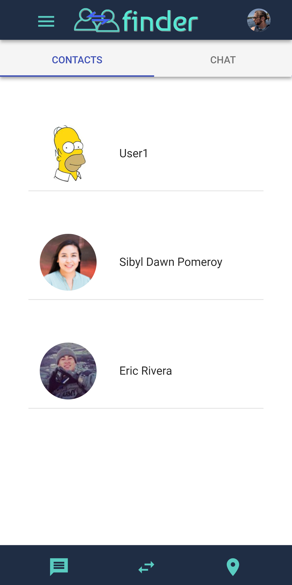

## Finder is a project built by web developers Michael Kerr, Eric Rivera, and Sibyl Pomeroy.

#### Finder's purpose is to provide a simple, Tinder-like swiping interface for matching job applicants and recuiters together. It allows users to find each other based on industry and position, then opens a chat channel so they can discuss the implications of potential jobs.

***

### The following technologies are showcased in the code of the project:
- JavaScript
- React
- Node
- PostgresQL
- CSS
- React Context API
- Enzyme
- Jest
- Chai
- Cypress
- Pusher ChatKit
- Google Maps API
- MaterialUI
- Nodemailer
- Redis

***

#### Home view (no user logged in)

All features of Finder require a user to be logged in through their LinkedIn account.

#### Logged in profile view

After logging in using Auth0, users can access their profile page.

#### Profile edit view

Here, the user can enter and update their profile information - which is then saved in a database.

#### Job map

This map populates with the approximate locations of nearby users that are the opposite role (recruiter/applicant) as the logged in user (Google Maps API).

#### User settings

This is where a user can change his or her recruiter/applicant status, or temporarily deactivate their account if they've found what they are looking for on Finder for now. Additionally, a user may completely delete their account from the database or change their email address.

#### Home view

Returning home, the user now sees potential matches within their industry. If they are an applicant, recruiters' cards will show up here. If the are a recruiter, applicants' cards will appear.

#### Match success

In the event of a match (both users have swiped right on each other), an animation will appear and an email sent to each user notifying them (Nodemailer).

#### Contacts

All matches a user makes adds the match to this contacts screen.

#### Chat

By tapping on one of the contacts, a user can open a live chat window to speak to them directly (Pusher ChatKit).

